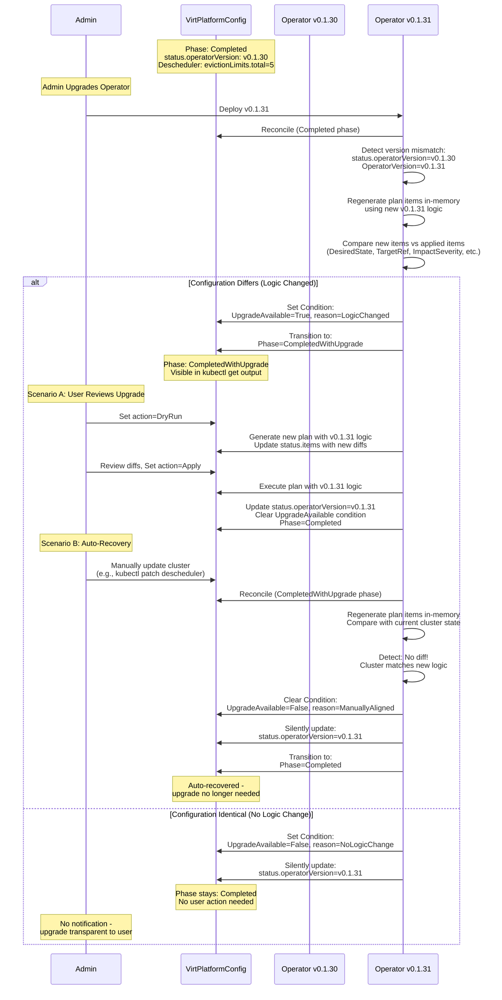
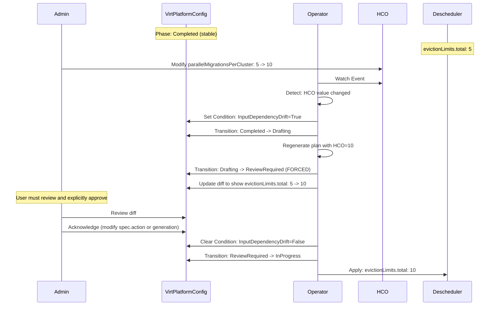
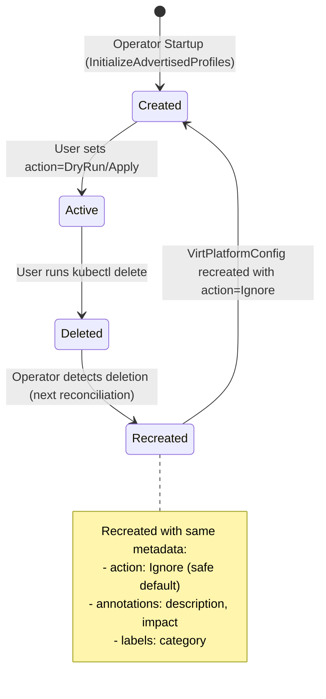

# VEP-NNNN: Operational Governance Layer for 3rd Party Integration

|                      |                                                              |
| :------------------- | :----------------------------------------------------------- |
| **TEP ID** | NNNN                                                         |
| **Status** | Implementable                                                |
| **Sig** | sig-compute                                                  |
| **Authors** | @tiraboschi                                                  |
| **Created** | 2025-12-10                                                   |
| **Last Updated** | 2025-12-19                                                   |

## Summary

This proposal introduces a new controller and API, `VirtPlatformConfig`, designed to act as an **Operational Governance Layer** for OpenShift Virtualization.

Its primary purpose is to configure and tune external, 3rd-party operators (such as the Cluster Descheduler, Node Health Check, or Machine Config Operator) that are not directly owned by the HyperConverged Cluster Operator (HCO). Instead of automatically applying changes, this controller adopts an **"Advisor" pattern**: it detects optimization opportunities based on a selected `profile`, generates a detailed preview (diff) of the proposed changes, and waits for explicit administrative approval before execution.

## Motivation

Configuring a production-grade Virtualization platform often requires tuning components outside the direct scope of the KubeVirt operator. For example:
* Enabling **Load Aware Rebalancing** requires configuring the *Descheduler Operator*.
* Optimizing **Swap** or **NUMA** settings requires creating `MachineConfig` objects via the *Machine Config Operator*.

Currently, cluster admins must manually read documentation, install these external operators, and craft complex configuration patches. This process is error-prone and lacks safety guardrails. If a user blindly applies a `MachineConfig` to enable performance metrics, they might unintentionally trigger a rolling reboot of the entire cluster without warning.

We need a mechanism that bridges the gap between the Virtualization platform's needs and these external tools without taking full ownership of them.

### Goals

* **Soft Dependency Management:** Provide a way to utilize external operators without requiring them as hard dependencies.
* **Preview & Approve Workflow:** Implement a "Plan" pattern where changes are calculated, visualized as a diff, and gated by a specific action (`DryRun` vs `Apply`).
* **Safety by Design:** Prevent conflicts via optimistic locking and singleton profile enforcement.
* **Stable Evolution:** Ensure operator upgrades do not automatically trigger disruptive configuration changes without user review.
* **Drift Management:** Detect and alert if the applied configuration is later modified by external actors.

### Non-Goals

* **Lifecycle Management:** We will not install or upgrade the 3rd party operators. That remains the responsibility of OLM.
* **Continuous Enforcement:** We will not automatically revert external changes. We alert on drift, but leave remediation to the admin.

## Proposal

We propose a new CRD `VirtPlatformConfig` in the `advisor.kubevirt.io` API group. This resource acts as a state machine for requesting, calculating, and applying complex configuration changes.

### User Workflow & Entry Point

The workflow depends on the admin's desired level of control: **Interactive Review** or **Auto-Approval**.

**1. Discovery via Profile Advertising:**

To improve discoverability and reduce the barrier to entry, the operator automatically creates VirtPlatformConfig objects for all available profiles during initialization. These pre-created resources serve as living documentation and enable a seamless activation workflow.

**Implementation Strategy:**
1. **Startup Initialization:** During controller startup, the operator queries the profile registry for all "real" (non-example) profiles.
2. **Resource Creation:** For each profile, it creates a VirtPlatformConfig object with:
   - `metadata.name`: Matching the profile name (enforced by CEL validation)
   - `spec.profile`: The profile name
   - `spec.action`: `Ignore` (safe by default - no immediate reconciliation)
   - `metadata.annotations`: Helpful metadata like description, prerequisites, impact level
   - `metadata.labels`: Classification tags (e.g., `advisor.kubevirt.io/category: scheduling`)

3. **Idempotency:** On each startup, check if VirtPlatformConfig exists. If yes, skip (respect user modifications). If no, create with `action: Ignore`.

4. **Lifecycle:** Objects are auto-created on every startup if missing. If a user deletes one, it will be recreated on next restart with `action: Ignore` (which is harmless - no reconciliation occurs). Users who want to "hide" a profile don't need to delete it - they simply leave it with `action: Ignore`.

**User Experience:**

Instead of reading documentation or inspecting CRD schemas, admins can simply:

```bash
# Discover all available profiles
$ kubectl get virtplatformconfig
NAME                      ACTION   IMPACT   PHASE     AGE
load-aware-rebalancing    Ignore   Medium   Ignored   5m
virt-higher-density       Ignore   High     Ignored   5m

# Inspect a profile's details via annotations
$ kubectl get virtplatformconfig load-aware-rebalancing -o yaml
# Shows description, prerequisites, and configuration options in annotations

# Activate a profile (simple two-step workflow)
$ kubectl patch virtplatformconfig load-aware-rebalancing \
  --type='json' -p='[{"op": "replace", "path": "/spec/action", "value":"DryRun"}]'
# Review the generated diff in status...
$ kubectl patch virtplatformconfig load-aware-rebalancing \
  --type='json' -p='[{"op": "replace", "path": "/spec/action", "value":"Apply"}]'
```

**Benefits:**
- **Self-Documenting:** The cluster advertises its own capabilities via standard Kubernetes resources
- **Lower Cognitive Load:** No need to memorize profile names or search external documentation
- **Kubernetes-Native Discovery:** Uses familiar `kubectl get` commands instead of reading docs
- **Safe Exploration:** Admins can inspect pre-created objects without triggering changes
- **Consistent Workflow:** Activation is always a simple `kubectl patch` operation
- **Version Awareness:** Auto-created objects reflect the profiles available in the deployed operator version
- **GitOps Friendly:** Pre-created resources can be exported and version-controlled

**Alternative Discovery (Traditional):**
For admins who prefer CRD introspection:
```bash
$ kubectl explain virtplatformconfig.spec.profile
# Valid values: "load-aware-rebalancing", "high-density-swap"...
```

**2. The "Action" Model:**
The `spec.action` field dictates the controller's behavior:
* **`DryRun` (Default):** The controller calculates the plan, populates the diff in `.status`, and pauses.
* **`Apply`:** The controller calculates the plan and, if prerequisites are met, immediately executes it.
* **`Ignore`:** The controller completely ignores this configuration - no planning, no drift detection, no metrics. The resource is effectively paused. **IMPORTANT:** Changing to `Ignore` does NOT rollback or undo any changes previously applied by this profile. Resources remain in their current state, and the cluster admin assumes full manual control of those resources. Use this to hand over management control without deleting the object.

### User Stories

#### Story 1: Interactive Review (Manual Gate)
As a cautious admin, I want to verify changes before they touch production.
1.  I create a manifest with `action: DryRun`.
2.  The Operator sets `status.phase = ReviewRequired` and populates `status.diff`.
3.  I inspect the diff. I decide to proceed: `kubectl patch virtplatformconfig ... -p '{"spec": {"action": "Apply"}}'`
4.  The Operator advances to execution.

#### Story 2: Auto-Approval (Fire and Forget)
As an admin using GitOps, I want to enable a profile immediately.
1.  I apply a manifest with `action: Apply`.
2.  The Operator immediately checks prerequisites.
3.  Since `action` is `Apply`, it skips the pause and moves directly to `InProgress`.

#### Story 3: Hand Over Management Control (Ignore)
As an admin troubleshooting an issue, I want to take manual control of resources without the operator interfering.
1.  I patch the existing VirtPlatformConfig: `kubectl patch virtplatformconfig load-aware-rebalancing -p '{"spec": {"action": "Ignore"}}'`
2.  The Operator transitions to `phase: Ignored` and sets the `Ignored` condition to True.
3.  No drift detection, no metrics collection, no reconciliation occurs. **Resources remain in their current state** - any changes previously applied by the profile are NOT rolled back.
4.  I now have full manual control of the affected resources (KubeDescheduler, MachineConfigs, etc.).
5.  When ready to resume operator management, I change the action back to `DryRun` or `Apply`.
6.  The Operator resets to `Pending` phase and regenerates the plan from scratch based on current cluster state.

#### Story 4: Operator Upgrade Detection and Smart Adoption
As an admin who upgraded the virt-advisor-operator, I want to be notified about new profile logic only when it would actually change my cluster configuration.

**Scenario A: Upgrade with Logic Changes (User Notification Required)**
1.  I have VirtPlatformConfig "load-aware-rebalancing" in `phase: Completed` with `status.operatorVersion: v0.1.30`
2.  The cluster has Descheduler configured with `evictionLimits.total: 5` (from old operator logic)
3.  I upgrade the virt-advisor-operator to `v0.1.31` via OLM
4.  **New operator behavior**: The new version changes the eviction limit calculation to `total: 10` for better performance
5.  The Operator detects version mismatch and regenerates plan items in-memory using new logic
6.  **Semantic comparison**: Compares new items vs. applied items - detects that DesiredState differs (5 → 10)
7.  The Operator transitions to `phase: CompletedWithUpgrade` and sets `UpgradeAvailable=True` condition
8.  I see the upgrade notification in `kubectl get virtplatformconfig` output
9.  I review the upgrade: `kubectl patch virtplatformconfig load-aware-rebalancing -p '{"spec": {"action": "DryRun"}}'`
10. The Operator regenerates the plan with new v0.1.31 logic and shows the diff in status
11. I approve the upgrade: `kubectl patch virtplatformconfig load-aware-rebalancing -p '{"spec": {"action": "Apply"}}'`
12. The Operator applies the new configuration, updates `status.operatorVersion: v0.1.31`, and returns to `phase: Completed`

**Scenario B: Upgrade Without Logic Changes (Silent Update)**
1.  I have VirtPlatformConfig "virt-higher-density" in `phase: Completed` with `status.operatorVersion: v0.1.30`
2.  I upgrade the virt-advisor-operator to `v0.1.31` via OLM
3.  **New operator behavior**: The new version has bug fixes but produces identical configuration
4.  The Operator detects version mismatch and regenerates plan items in-memory
5.  **Semantic comparison**: Compares new items vs. applied items - detects NO differences
6.  The Operator **silently** updates `status.operatorVersion: v0.1.31`
7.  The phase **stays** `Completed` - no user notification required
8.  My cluster continues running without interruption

**Scenario C: Auto-Recovery After Manual Alignment**
1.  I have VirtPlatformConfig in `phase: CompletedWithUpgrade` with `UpgradeAvailable=True`
2.  Instead of using the operator, I manually update the Descheduler to match the new operator's logic: `kubectl patch kubedescheduler cluster -p '{"spec": {"evictionLimits": {"total": 10}}}'`
3.  The Operator reconciles and regenerates plan items in-memory
4.  **Semantic comparison**: Detects that current cluster state now matches new logic
5.  The Operator **auto-resolves**: clears `UpgradeAvailable` condition, updates `status.operatorVersion`, returns to `phase: Completed`
6.  No further action needed - the cluster is already aligned with the new version

### API Design

```yaml
apiVersion: advisor.kubevirt.io/v1alpha1
kind: VirtPlatformConfig
metadata:
  generateName: plan-
spec:
  profile: "LoadAwareRebalancing"
  action: "DryRun"

  # Control how to handle failures in a multi-step plan.
  # Options:
  # - "Abort": (Default) Stop executing subsequent items if one fails.
  # - "Continue": Attempt to apply remaining items even if one fails.
  failurePolicy: "Abort"

  # Emergency escape hatch - disables optimistic locking checks.
  # WARNING: Dangerous! Only use in recovery scenarios or dev/test environments.
  # When true, applies changes even if target resources were modified since plan generation.
  # Defaults to false.
  bypassOptimisticLock: false

  # Maximum time to wait for resources to become healthy after applying changes.
  # Particularly important for MachineConfig rollouts that can take hours on large clusters.
  # If not set, waits indefinitely (recommended for production).
  # Examples: "30m", "2h", "24h"
  waitTimeout: "2h"

status:
  phase: InProgress
  sourceSnapshotHash: "sha256:..."

  # Conditions track special situations like drift detection, input changes, etc.
  conditions:
    - type: InputDependencyDrift  # Detects when HCO-derived configuration changes
      status: "False"
      reason: "NoChange"
      message: "HCO migration limits unchanged"

  # Richer Item Status
  items:
    - name: "enable-psi-metrics"
      # Plan Data (Calculated in DryRun)
      impactSeverity: High  # Enum: Low | Medium | High
      diff: |
        + apiVersion: machineconfiguration.openshift.io/v1...

      # Execution Data (Updated in Apply)
      # State: Pending | InProgress | Completed | Failed
      state: InProgress
      # Real-time feedback (e.g., "Waiting for MCP update")
      message: "Waiting for MachineConfigPool 'worker' to stabilize (2/10 nodes updated)"
      lastTransitionTime: "2025-10-10T12:00:00Z"

      # Tracks which spec fields this item manages for focused drift detection
      managedFields:
        - "spec.kernelArguments"
```

### Architecture Details

#### 1. Plan Generation Strategy (The Diff Engine)

To generate accurate, human-readable diffs that respect Kubernetes defaults, webhooks, and co-ownership (e.g., fields managed by ArgoCD), we strictly avoid client-side text comparisons. Instead, we leverage **Server-Side Apply (SSA) in Dry-Run mode**.

**The Generation Algorithm:**
1.  **Construct Intent:** The Operator constructs the desired `ApplyConfiguration` based on the selected `profile`.
2.  **Dry-Run Apply:** It sends a PATCH request with `DryRun: ["All"]` and `FieldManager: "virt-advisor-operator"`.
3.  **Sanitize:** It retrieves the Live Object and the Result Object, stripping noise (timestamps, `managedFields`).
4.  **Compute Diff:** It calculates the Unified Diff between `Sanitized(Live)` and `Sanitized(Result)`.

**Handling Defaults & Explicit Intent:**
Profiles must be **Exhaustive**. If a CRD default is `true` but the live object is `false`, the profile logic must explicitly send `true` in the patch. SSA will not re-apply defaults unless the field is present in the configuration.

#### 2. Conflict Handling (Optimistic Locking)
To prevent TOCTOU (Time-of-Check to Time-of-Use) conflict, we use a snapshot hash.
* **Drafting:** We store `status.sourceSnapshotHash = Hash(LiveTarget.Spec)`.
* **Execution:** We check `Hash(LiveTarget.Spec) == status.sourceSnapshotHash`.
* **Reaction:** If they mismatch, the plan fails with a `PlanStale` condition.


#### 3. Handling Concurrent Plans (Singleton Locking)
To prevent conflicting instructions, we enforce a strict **One-Plan-Per-Profile** rule. A `profile` cannot be managed by multiple `VirtPlatformConfig` objects simultaneously.

**Implementation Approach:**
We use **CEL validation** to bind the VirtPlatformConfig name to the profile it manages. This provides compile-time enforcement of the singleton pattern at the API level.

**CEL Validation Rule:**
```yaml
# +kubebuilder:validation:XValidation:rule="self.metadata.name == self.spec.profile"
```

This ensures that:
- `VirtPlatformConfig` named "load-aware-rebalancing" can ONLY manage profile "load-aware-rebalancing"
- Users cannot create multiple VirtPlatformConfigs for the same profile (name collision prevents it)
- The singleton pattern is enforced declaratively without controller logic

**Example:**
```yaml
apiVersion: advisor.kubevirt.io/v1alpha1
kind: VirtPlatformConfig
metadata:
  name: load-aware-rebalancing  # Must match spec.profile
spec:
  profile: load-aware-rebalancing  # CEL validation enforces name == profile
  action: DryRun
```

Attempting to create a second VirtPlatformConfig for the same profile will fail with a name conflict error from the Kubernetes API server.

**Benefits of CEL Approach:**
- ✅ **Declarative:** Enforced at API admission, not controller reconciliation
- ✅ **Fast:** Rejects invalid configs immediately, no async error handling
- ✅ **Simple:** No complex controller logic for lock management
- ✅ **Race-free:** Kubernetes API server handles concurrent create atomically

#### 4. Handling Configuration Churn (Drift Detection)
Once a plan is `Completed`, the Operator enters a **Governance Watch Mode**. We adopt an **"Inform, Don't Fight"** strategy.

**Drift Strategy:**
1.  **Fingerprinting:** Upon application, we annotate the target resource with `advisor.kubevirt.io/applied-profile-hash`.
2.  **Detection:** We watch the target. If `Hash(LiveFields) != AnnotationHash`, drift is detected.
3.  **Reaction:** We set the Plan status to `Drifted` and emit a Prometheus metric. We do **not** auto-revert.


#### 5. Release & Evolution Strategy (Upgrades)
To ensure stability during operator upgrades, we adhere to a **"Sticky Logic"** policy with **intelligent upgrade detection**.

**Smart Upgrade Detection:**

The operator only notifies users about upgrades when profile logic changes would **actually affect the cluster configuration**. If a new operator version produces the exact same configuration, no user notification occurs - the version is silently updated.

**Upgrade Workflow:**
1.  **Detection:** When the operator detects a version mismatch (`status.operatorVersion != OperatorVersion`), it regenerates plan items in-memory using the new profile logic
2.  **Semantic Comparison:** The operator performs a deep comparison of:
    - Desired state (actual configuration JSON)
    - Number of plan items (new resources added/removed)
    - Target references (different resources being managed)
    - Impact severity changes
    - Managed fields
3.  **Smart Decision:**
    - **If configuration differs:** Transition to `CompletedWithUpgrade` phase and set `UpgradeAvailable=True` condition
    - **If configuration identical:** Silently update `status.operatorVersion` - stay in `Completed` phase
4.  **Visibility:** New phase `CompletedWithUpgrade` makes upgrade availability immediately visible in `kubectl get` output
5.  **Auto-Recovery:** If admin manually updates cluster to match new operator logic, the diff disappears and operator automatically transitions back to `Completed` phase with silent version update
6.  **User Action:** To adopt upgrade, user must regenerate plan (`action=DryRun`) then approve (`action=Apply`)



#### 6. Execution Orchestration (The Sequential Engine)
When `action` is set to `Apply`, the controller executes the generated `items` list **sequentially** (0 -> N). This order is critical because profiles often have dependencies (e.g., "Create the MachineConfig first" -> "Wait for Reboot" -> "Then configure the component that relies on it").

**The State Machine per Item:**

1.  **Pending:** The item waits for the previous item to reach `Completed`.
2.  **InProgress:**
    * The patch is applied.
    * **Wait Strategy:** If the item has `impactSeverity: High` (e.g., MachineConfig), the controller enters a polling loop. It checks the health of the related workload (e.g., is `MachineConfigPool` ready? Is the `Deployment` available?).
    * The `status.items[i].message` is updated periodically with progress to provide feedback to the admin.
3.  **Completed:** The resource is applied and verified as healthy. The controller proceeds to `i+1`.
4.  **Failed:** The patch failed API validation or the wait strategy timed out.

**Handling Failures (`failurePolicy`):**

* **If `failurePolicy: Abort` (Default):**
    * The current item is marked `Failed`.
    * All subsequent items remain `Pending`.
    * The global Plan Phase becomes `Failed`.
    * *Reasoning:* Prevents leaving the cluster in an inconsistent, half-configured state if a dependency breaks.
* **If `failurePolicy: Continue`:**
    * The current item is marked `Failed`.
    * The controller logs the error and proceeds to execute item `i+1`.
    * The global Plan Phase becomes `CompletedWithErrors` at the end.

#### 7. Input Dependency Drift Detection

Some profiles derive their configuration from external sources. For example, the `load-aware-rebalancing` profile reads eviction limits from HyperConverged (HCO) CR migration configuration. When these **input dependencies** change externally, the operator must detect this drift and force a review cycle.

**The Problem:**
Imagine this scenario:
1. Admin enables `load-aware-rebalancing` with `action: Apply`
2. Profile reads `spec.liveMigrationConfig.parallelMigrationsPerCluster: 5` from HCO
3. Descheduler is configured with `evictionLimits.total: 5` (derived from HCO)
4. Plan reaches `Completed` phase
5. **Days later:** Another admin modifies HCO to set `parallelMigrationsPerCluster: 10`
6. **Issue:** The Descheduler still has `evictionLimits.total: 5`, which is now stale and incorrect

**The Solution: InputDependencyDrift Condition**

The controller continuously monitors input dependencies (like HCO) for changes. When detected:

1. **Detection:** Controller compares HCO's current migration limits against the values used when the plan was generated
2. **Marking:** Sets a special condition `InputDependencyDrift: True` in the VirtPlatformConfig status
3. **Forced Review:** Transitions the plan to `Drafting` phase to regenerate the plan with current HCO values
4. **Mandatory User Action:** Even if `spec.action=Apply`, the plan enters `ReviewRequired` phase and blocks auto-execution
5. **Clear Feedback:** Status message explains which input dependency changed (e.g., "HCO migration limit changed from 5 to 10")

**Handling the Drift:**



**Auto-Resolution:**
If the external change is reverted (e.g., HCO goes back to `parallelMigrationsPerCluster: 5`), the controller detects that the drift has resolved and automatically clears the `InputDependencyDrift` condition, regenerates the plan, and returns to `Completed` phase without user intervention.

**Benefits:**
- ✅ **Consistency:** Ensures configurations stay synchronized with their input sources
- ✅ **Safety:** Prevents stale derived configurations from causing operational issues
- ✅ **Transparency:** Users see exactly what changed and why a review is needed
- ✅ **Smart Recovery:** Auto-resolves if changes revert

**Implementation:**
The controller tracks input dependencies via `status.appliedOptions` and periodically reconciles to detect changes. When drift is detected, it sets the `InputDependencyDrift` condition and forces regeneration with mandatory review.

#### 8. Emergency Recovery Mode (Bypass Optimistic Locking)

The optimistic locking mechanism (hash-based staleness checks) is a critical safety feature, but in rare emergency scenarios, it can become an obstacle to recovery. The `spec.bypassOptimisticLock` field provides a controlled escape hatch.

**When to Use (Emergency Scenarios Only):**

1. **Recovery from Manual Interventions:** An admin manually fixed a broken configuration during an incident, and now the operator refuses to apply because the hash doesn't match
2. **Breaking Circular Dependencies:** Two systems are stuck in a conflict loop, and you need the operator to force-apply to break the cycle
3. **Development/Testing:** Rapid iteration in dev environments where safety checks slow down experimentation

**How It Works:**

```yaml
apiVersion: advisor.kubevirt.io/v1alpha1
kind: VirtPlatformConfig
metadata:
  name: load-aware-rebalancing
spec:
  profile: load-aware-rebalancing
  action: Apply
  bypassOptimisticLock: true  # DANGER: Skips staleness checks!
```

**Behavior Changes:**

| Feature | Normal Mode (`bypassOptimisticLock: false`) | Bypass Mode (`bypassOptimisticLock: true`) |
|---------|---------------------------------------------|-------------------------------------------|
| **Hash Validation** | Verifies target resources unchanged since plan generation | ❌ Skips hash check entirely |
| **Drift Detection** | One-time alert on drift, then stops reconciling | ⚠️ **Aggressive continuous enforcement** - keeps reapplying on every reconciliation |
| **Failure on Staleness** | Fails with `PlanStale` condition if resources modified | ✅ Applies even if resources were modified |
| **Safety** | High - prevents overwriting manual changes | ⚠️ **Low - can overwrite any changes** |
| **Use Case** | Production (default) | Emergency recovery, dev/test only |

**Critical Warning:**

When `bypassOptimisticLock: true`:
- The operator **continuously reconciles** and reapplies configuration
- Manual changes to target resources are **immediately overwritten**
- The operator enters an "autopilot mode" that fights against drift
- This mimics traditional Kubernetes operators but **removes the governance model's safety guarantees**

**Production Guidance:**

```yaml
# ❌ NEVER do this in production without understanding the consequences
spec:
  bypassOptimisticLock: true
  action: Apply

# ✅ Instead, use the normal workflow:
# 1. Detect drift: Plan shows Drifted phase
# 2. Review changes: Set action=DryRun to regenerate plan
# 3. Approve: Set action=Apply to re-execute with current state
```

**Implementation Note:**
The bypass flag is checked in the executor before hash validation. When true, the executor skips the hash comparison and proceeds directly to applying the configuration. Additionally, the drift detector continues to reconcile aggressively rather than entering passive watch mode.

#### 9. Profile Advertising Lifecycle

To improve discoverability and reduce friction, the operator automatically creates `VirtPlatformConfig` objects for all advertisable profiles during startup. However, users may delete these advertised profiles (e.g., to "hide" features they don't want). The controller has logic to handle this gracefully.

**Auto-Recreation Behavior:**

The operator monitors for deletion events on VirtPlatformConfig resources. When a deletion is detected:

1. **Check Profile Type:** Is this a profile from the registry?
2. **Check Advertisable Flag:** Does `profile.IsAdvertisable()` return `true`?
3. **Recreate if Advertisable:** If yes to both, recreate the VirtPlatformConfig with `action: Ignore`

**Lifecycle States:**



**Why Auto-Recreate?**

1. **Discoverability:** New admins can always discover available profiles via `kubectl get virtplatformconfig`
2. **Idempotency:** If a user accidentally deletes all profiles, they reappear on next restart
3. **Version Tracking:** Operator upgrades that add new profiles automatically advertise them
4. **Harmless:** Since recreated profiles have `action: Ignore`, no reconciliation occurs

**User Workflow:**

```bash
# User deletes a profile they don't want to see
$ kubectl delete virtplatformconfig virt-higher-density
virtplatformconfig.advisor.kubevirt.io "virt-higher-density" deleted

# Operator detects deletion and recreates it
$ kubectl get virtplatformconfig virt-higher-density
NAME                  ACTION   IMPACT   PHASE     AGE
virt-higher-density   Ignore   High     Ignored   2s
```

**Alternative: Hiding Without Deletion**

Users who want to "hide" a profile don't need to delete it. They can simply leave it with `action: Ignore`:

```bash
# This profile exists but doesn't reconcile
$ kubectl get virtplatformconfig
NAME                      ACTION   IMPACT   PHASE     AGE
load-aware-rebalancing    DryRun   Medium   Pending   10m
virt-higher-density       Ignore   High     Ignored   10m  # "Hidden" but discoverable
```

**Implementation:**

The controller's `Reconcile` loop handles deletion events:

```go
func (r *VirtPlatformConfigReconciler) Reconcile(ctx context.Context, req ctrl.Request) {
    // ... existing reconciliation logic ...

    if !configPlan.DeletionTimestamp.IsZero() {
        // Object is being deleted - check if we should recreate it
        if r.shouldRecreateAdvertisedProfile(req.Name) {
            logger.Info("Recreating deleted advertised profile")
            r.createAdvertisedProfile(ctx, r.Client, req.Name, logger)
        }
        return ctrl.Result{}, nil
    }

    // ... rest of reconciliation ...
}
```

**Benefits:**
- ✅ **Self-Healing:** Profiles are always discoverable even after accidental deletion
- ✅ **Zero User Action:** No manual steps needed to restore advertised profiles
- ✅ **Safe Default:** Recreated profiles use `action: Ignore` (no side effects)
- ✅ **Operator Upgrades:** New profiles from updated operators automatically appear

## Examples

To illustrate the controller's behavior, we present a real-world scenario: enabling **"Load Aware Rebalancing & Node PSI Metrics"**. This profile requires two distinct operations:
1.  **Tuning:** Modifying an existing `KubeDescheduler` (Merge operation).
2.  **Infrastructure:** Creating a new `MachineConfig` to enable Pressure Stall Information (PSI) kernel arguments (Create operation).

### 1. The User Intent
The admin creates the following Plan:

```yaml
apiVersion: advisor.kubevirt.io/v1alpha1
kind: VirtPlatformConfig
metadata:
  generateName: enable-psi-scheduling-
spec:
  profile: "LoadAwareRebalancing"
  action: "DryRun"
  failurePolicy: "Abort" # Stop if the MachineConfig fails
```

### 2. The Generated Status (Dry Run)
The operator reconciles the plan. It populates the diffs and initializes the item states to `Pending`.

```yaml
status:
  phase: ReviewRequired
  sourceSnapshotHash: "sha256:a1b2c3d4..."
  
  conditions:
  - type: UpgradeAvailable
    status: "False"

  items:
  # ITEM 1: The Descheduler
  - name: "configure-descheduler"
    state: Pending
    targetRef:
      kind: KubeDescheduler
      name: cluster
    impactSeverity: Low  # Enum: Low | Medium | High
    diff: |
      apiVersion: operator.openshift.io/v1
      kind: KubeDescheduler
      metadata:
        name: cluster
      spec:
    -   deschedulingIntervalSeconds: 30
    +   deschedulingIntervalSeconds: 60
    +   evictionLimits:
    +     node: 2
    +     total: 5
        profiles:
    -     - LongLifecycle
    +     - KubeVirtRelieveAndMigrate
        profileCustomizations:
    +     devActualUtilizationProfile: PrometheusCPUCombined
    +     devDeviationThresholds: AsymmetricLow
    -     devEnableSoftTainter: false
    +     devEnableSoftTainter: true

  # ITEM 2: The MachineConfig
  - name: "enable-psi-metrics"
    state: Pending
    targetRef:
      kind: MachineConfig
      name: 99-worker-psi-karg
    impactSeverity: High  # Node reboot required
    diff: |
    + apiVersion: machineconfiguration.openshift.io/v1
    + kind: MachineConfig
    + metadata:
    +   labels:
    +     machineconfiguration.openshift.io/role: worker
    +   name: 99-worker-psi-karg
    + spec:
    +   kernelArguments:
    +     - psi=1
```

### 3. Execution (Apply)
When the user switches `action` to `Apply`, the Operator updates the status in real-time as it progresses through the list.

**Snapshot during execution (Item 2 is rolling out):**

```yaml
status:
  phase: InProgress
  items:
  - name: "configure-descheduler"
    state: Completed
    message: "Patch applied successfully"
    lastTransitionTime: "2025-10-10T12:00:00Z"
    
  - name: "enable-psi-metrics"
    state: InProgress
    message: "Waiting for MCP 'worker' to stabilize (Updated: 2/10 nodes, Ready: 2/10 nodes)"
    lastTransitionTime: "2025-10-10T12:05:00Z"
```

**Snapshot after completion:**

```yaml
status:
  phase: Completed
  items:
  - name: "configure-descheduler"
    state: Completed
    
  - name: "enable-psi-metrics"
    state: Completed
    message: "MCP 'worker' is stable and ready"
```

#### Orchestration Flow:
When the user switches `action` to `Apply`, the Operator:
1.  **Verifies Safety Hash:** Checks `sourceSnapshotHash` matches live state.
2.  **Item 1 (Descheduler):** * Applies patch.
    * Status: `state: Completed`, `message: Applied successfully`.
3.  **Item 2 (MachineConfig):**
    * Applies manifest.
    * **Wait Loop:** The operator detects `MachineConfig` type. It checks the `worker` MCP status.
    * Status: `state: InProgress`, `message: Waiting for MCP rollout (Updated: 2/10, Ready: 2/10)`.
    * *(Time passes...)*
    * Status: `state: Completed`, `message: MCP Ready`.
4.  **Completion:** All items are `Completed`. Global Phase becomes `Completed`.

## Implementation Guidelines

To maintain the "Advisor" role without creating hard dependencies (Golang imports) on 3rd-party operators, the controller must be implemented using controller-runtime **Dynamic Client** patterns. This ensures the Governance Operator can be installed on a cluster even if the tools it manages (e.g., Descheduler) are not present.

### 1. Managing Soft Dependencies (Dynamic Interaction)
The controller **must not** import the API packages of the external operators (e.g., `github.com/openshift/descheduler-operator/api`). Doing so creates a rigid dependency chain.

**Strategy: Unstructured Objects**
Instead, we use `unstructured.Unstructured` for all interactions with 3rd-party resources. This allows the controller to manipulate resources based on GVK (GroupVersionKind) without compiling their types into the binary.

```go
// Example: construct the Descheduler object dynamically
u := &unstructured.Unstructured{}
u.SetGroupVersionKind(schema.GroupVersionKind{
    Group:   "operator.openshift.io",
    Version: "v1",
    Kind:    "KubeDescheduler",
})
// Interaction uses generic maps
u.Object["spec"] = map[string]interface{}{
    "mode": "Automatic",
    // ...
}
```

### 2. Dependency Discovery & Validation
Before generating a plan, the controller must verify that the environment supports the requested Profile. This goes beyond simple version checking; it involves **Capability Discovery**.
We don't want to relay on statics semver checks on CSV (that is going to disappear on OLMv1) but to dynamically check the capabilities of the installed operators.

**A. Existence Check (CRD Detection)**
The controller checks if the required CRD is registered in the API Server using the RESTMapper.
```go
func isCRDAvailable(mgr manager.Manager, gvk schema.GroupVersionKind) bool {
    mapper := mgr.GetRESTMapper()
    _, err := mapper.RESTMapping(gvk.GroupKind(), gvk.Version)
    return err == nil
}
```

**B. Capability Check (Schema Introspection)**
To ensure a specific configuration (e.g., a specific Descheduler profile) is valid, we should inspect the **CRD OpenAPI Schema** rather than relying on the Operator version. This allows us to detect valid values (enums) dynamically.

*Example: Checking if `HighNodeUtilization` is a valid profile.*
1.  Fetch the `CustomResourceDefinition` (CRD) for `kubedeschedulers.operator.openshift.io`.
2.  Traverse the JSON Schema: `spec.versions[].schema.openAPIV3Schema.properties.spec.properties.profiles.items.enum`.
3.  Check if `KubeVirtRelieveAndMigrate` or `DevKubeVirtRelieveAndMigrate` are in the allowed list.

### 3. Profile Metadata & Advertising

To support the profile advertising feature (auto-initialization of VirtPlatformConfig objects), the Profile interface must be extended to expose metadata that can be used to populate annotations and labels on the auto-created resources.

**Extended Profile Interface:**

```go
type Profile interface {
    // Core functionality (existing)
    GetName() string
    GetPrerequisites() []discovery.Prerequisite
    Validate(config map[string]string) error
    GeneratePlanItems(ctx context.Context, c client.Client, config map[string]string) ([]advisorv1alpha1.VirtPlatformConfigItem, error)
    GetManagedResourceTypes() []schema.GroupVersionKind

    // Metadata for advertising (new)
    GetDescription() string        // Human-readable one-line description
    GetCategory() string            // e.g., "scheduling", "performance", "storage", "networking"
    GetImpactSummary() string      // e.g., "Medium - May require node reboots", "Low - Configuration only"
    GetImpactLevel() Impact         // Ordered enum: Low | Medium | High (for kubectl display)
    GetDocumentationURL() string   // Link to detailed docs
    IsAdvertisable() bool          // false for example/dev/internal profiles
}
```

**Auto-Initialization Logic:**

During controller startup (in `SetupWithManager` or a dedicated initialization reconciler):

```go
func (r *VirtPlatformConfigReconciler) initializeAdvertisedProfiles(ctx context.Context) error {
    logger := log.FromContext(ctx)

    // Get all advertisable profiles from registry
    for _, profileName := range profiles.DefaultRegistry.List() {
        profile, _ := profiles.DefaultRegistry.Get(profileName)

        // Skip non-advertisable profiles (e.g., "example-profile")
        if !profile.IsAdvertisable() {
            continue
        }

        // Check if VirtPlatformConfig already exists (user may have created/modified it)
        existing := &advisorv1alpha1.VirtPlatformConfig{}
        err := r.Get(ctx, types.NamespacedName{Name: profileName}, existing)

        if err == nil {
            // Object exists - don't overwrite user modifications
            logger.V(1).Info("VirtPlatformConfig already exists, skipping initialization",
                "profile", profileName)
            continue
        }

        if !errors.IsNotFound(err) {
            return err
        }

        // Create new VirtPlatformConfig with Ignore action
        vpc := &advisorv1alpha1.VirtPlatformConfig{
            ObjectMeta: metav1.ObjectMeta{
                Name: profileName,
                Annotations: map[string]string{
                    "advisor.kubevirt.io/description":       profile.GetDescription(),
                    "advisor.kubevirt.io/impact-summary":    profile.GetImpactSummary(),
                    "advisor.kubevirt.io/documentation-url": profile.GetDocumentationURL(),
                    "advisor.kubevirt.io/auto-created":      "true", // Track that this was auto-created
                },
                Labels: map[string]string{
                    "advisor.kubevirt.io/category": profile.GetCategory(),
                },
            },
            Spec: advisorv1alpha1.VirtPlatformConfigSpec{
                Profile: profileName,
                Action:  advisorv1alpha1.PlanActionIgnore, // Safe by default
            },
        }

        if err := r.Create(ctx, vpc); err != nil {
            logger.Error(err, "Failed to create advertised VirtPlatformConfig", "profile", profileName)
            // Continue with other profiles instead of failing completely
            continue
        }

        logger.Info("Created advertised VirtPlatformConfig", "profile", profileName)
    }

    return nil
}
```

**Lifecycle Considerations:**

1. **Deletion by User:** If a user deletes a VirtPlatformConfig, it will be recreated on the next operator restart with `action: Ignore`. This is harmless since Ignore mode means no reconciliation occurs. Users don't need to delete profiles to "hide" them - they can simply leave them with `action: Ignore`.

2. **Upgrades:** When the operator upgrades and new profiles are added, the initialization logic will automatically create VirtPlatformConfigs for the new profiles on the next startup.

3. **Idempotency:** The initialization logic checks if each VirtPlatformConfig already exists before creating it. If it exists (whether user-created or previously auto-created), the logic skips it entirely to preserve user modifications.

**Example Profile Implementation:**

```go
type LoadAwareProfile struct{}

func (p *LoadAwareProfile) GetName() string {
    return "load-aware-rebalancing"
}

func (p *LoadAwareProfile) GetDescription() string {
    return "Enables load-aware VM rebalancing and PSI metrics for intelligent scheduling"
}

func (p *LoadAwareProfile) GetCategory() string {
    return "scheduling"
}

func (p *LoadAwareProfile) GetImpactSummary() string {
    return "Medium - May require node reboots if PSI metrics are enabled"
}

func (p *LoadAwareProfile) GetDocumentationURL() string {
    return "https://github.com/kubevirt/virt-advisor-operator/blob/main/docs/profiles/load-aware-rebalancing.md"
}

func (p *LoadAwareProfile) IsAdvertisable() bool {
    return true // This is a real profile, not an example
}

func (p *LoadAwareProfile) GetImpactLevel() Impact {
    return ImpactMedium
}

// ... existing methods (GetPrerequisites, Validate, GeneratePlanItems, etc.)
```

### 4. Impact Enum & Risk Assessment

To provide at-a-glance risk assessment in `kubectl get` output and help users make informed decisions, the API uses a strongly-typed `Impact` enum to categorize the risk level of configuration changes.

**Type Definition:**

```go
// Impact represents the risk level of a configuration change.
// The values are ordered by severity: Low < Medium < High.
// +kubebuilder:validation:Enum=Low;Medium;High
type Impact string

const (
    ImpactLow    Impact = "Low"     // Minimal risk, no service disruption
    ImpactMedium Impact = "Medium"   // Moderate risk, careful timing recommended
    ImpactHigh   Impact = "High"     // Significant risk, typically requires node reboots
)
```

**Usage in API:**

1. **Per-Item Impact** (`VirtPlatformConfigItem.impactSeverity`): Each plan item declares its risk level. Examples:
   - `Low`: Updating an existing KubeDescheduler configuration
   - `Medium`: Creating a new resource that doesn't require reboots
   - `High`: MachineConfig changes requiring node reboots

2. **Aggregate Impact** (`VirtPlatformConfigStatus.impactSeverity`): The status displays the **worst (highest) impact** across all plan items. This provides users with immediate visibility into the overall risk in `kubectl get` output.

**kubectl Output:**

```bash
$ kubectl get virtplatformconfigs
NAME                     ACTION   IMPACT   PHASE            AGE
load-aware-rebalancing   DryRun   High     ReviewRequired   5m
virt-higher-density      Ignore   High     Ignored          5m
```

**Aggregation Logic:**

The controller computes the aggregate impact by finding the maximum severity across all items:

```go
func aggregateImpactFromItems(items []VirtPlatformConfigItem) Impact {
    worstImpact := ImpactLow
    for _, item := range items {
        if compareImpact(item.Impact, worstImpact) {
            worstImpact = item.Impact
        }
    }
    return worstImpact
}
```

**Dynamic Impact Calculation:**

Impact is computed dynamically based on the actual plan items, not static profile metadata. This means:

- **Load-aware with PSI enabled**: Impact = `High` (MachineConfig + Descheduler)
- **Load-aware with PSI disabled** (`enablePSIMetrics: false`): Impact = `Low` (Descheduler only)

This dynamic approach ensures the Impact column accurately reflects the current configuration's risk.

**Benefits:**

- ✅ **Type Safety**: Compile-time validation prevents typos
- ✅ **Ordered Enum**: Clear severity ordering (Low < Medium < High)
- ✅ **kubectl Display**: At-a-glance risk assessment via printer columns
- ✅ **Dynamic**: Reflects actual plan items, not theoretical capabilities
- ✅ **Decision Support**: Helps users prioritize reviews and schedule maintenance windows

### 5. Handling Missing Dependencies in `VirtPlatformConfig`
If a soft dependency is missing or incompatible, the `VirtPlatformConfig` must gracefully halt to avoid crashing the controller.

**State Transitions:**
1.  **Detection:** Reconciler detects `KubeDescheduler` GVK is missing via RESTMapper.
2.  **Status Update:**
    * **Phase:** `PrerequisiteFailed`
    * **Condition:** `Type=PrerequisitesMet`, `Status=False`, `Reason=MissingDependency`.
    * **Message:** *"The CRD 'KubeDescheduler' is not found. Please install the Descheduler Operator via OLM."*
3.  **Behavior:** The controller **stops processing** (does not attempt to calculate Diff) and re-queues with a slow backoff (e.g., 5 minutes) to check if the user installed it later.

### 5. Controller Setup (Restart on Discovery)
We cannot register a standard `Watch` for a Kind that doesn't exist at startup, as this would cause the controller to crash during setup.
Handling dynamic watchers in `controller-runtime` is complex and prone to race conditions. Instead, we adopt a **"Restart on Discovery"** strategy.

**The Strategy:**
1.  **Initial Setup:** On startup, the controller checks for the existence of optional CRDs (e.g., `KubeDescheduler`). If found, it registers standard watches. If not, it skips them and marks the dependency as "Missing".
2.  **Sentinel Watch:** The operator registers a specific watch on `CustomResourceDefinitions` (CRDs).
3.  **Detection & Restart:**
    * If the Sentinel detects the creation of a CRD that was previously marked "Missing" (e.g., the user just installed the Descheduler Operator), it logs an event and **exits the process** (`os.Exit`).
    * Kubernetes restarts the Pod.
    * On the new boot, the "Initial Setup" finds the CRD and correctly registers the watch.

**Code Example (Sentinel):**
```go
func (r *CRDSentinel) Reconcile(ctx context.Context, req ctrl.Request) (ctrl.Result, error) {
    if isInterestingCRD(req.Name) && wasMissing(req.Name) {
        log.Info("Soft dependency discovered. Restarting to enable watchers.", "crd", req.Name)
        os.Exit(0) // Let Kubelet restart us
    }
    return ctrl.Result{}, nil
}
```
## RBAC & Security Model

Since this operator functions as a high-privilege **Governance Layer** capable of rebooting nodes (`MachineConfig`) and altering global scheduling (`KubeDescheduler`), its RBAC permissions must be broad but strictly justified.

To mitigate the risk of this operator becoming a "privilege escalation backdoor," we rely on the `VirtPlatformConfig` CR as the **Audit Log** and **Authorization Gate**. No action is taken without a persisted, approved CR.

### 1. Core Permissions
The operator requires standard access to its own API group to manage the state machine.

```yaml
rules:
  - apiGroups: ["advisor.kubevirt.io"]
    resources: ["virtplatformconfigs", "virtplatformconfigs/status"]
    verbs: ["get", "list", "watch", "update", "patch"]
```

### 2. 3rd Party Target Access (The "Keys to the Kingdom")
The operator needs write access to the specific resources defined in its supported Profiles.
* **Justification:** To apply the calculated Diff.
* **Scope:** We should attempt to limit this to specific resources if possible, but Cluster-scoped operators usually require Cluster-scoped RBAC.

```yaml
rules:
  # Descheduler Tuning
  - apiGroups: ["operator.openshift.io"]
    resources: ["kubedeschedulers"]
    verbs: ["get", "list", "watch", "patch"] # 'patch' is required for SSA

  # Node Tuning & Reboots (High Risk)
  - apiGroups: ["machineconfiguration.openshift.io"]
    resources: ["machineconfigs"]
    verbs: ["get", "list", "watch", "create", "delete", "patch"]
  
  # Monitoring Rollouts
  - apiGroups: ["machineconfiguration.openshift.io"]
    resources: ["machineconfigpools"]
    verbs: ["get", "list", "watch"] # Read-only to track reboot progress
```

### 3. Dynamic Discovery Permissions
To support the "Soft Dependency" model (checking if a CRD exists without crashing), the operator needs to read global discovery information.

```yaml
rules:
  - apiGroups: ["apiextensions.k8s.io"]
    resources: ["customresourcedefinitions"]
    verbs: ["get", "list", "watch"]
```

### 4. Security Mitigations
* **No `update` verb:** We prefer `patch` (Server-Side Apply) over `update` to ensure we do not accidentally overwrite fields owned by other controllers (like GitOps agents).
* **No `secrets` access:** This operator purely tunes configuration and infrastructure; it generally does not need to read Secrets, reducing the blast radius if compromised.
* **Provenance & Traceability:** Since Kubernetes audit logs only show the Operator's ServiceAccount as the actor, we explicitly link resources to their intent. The operator will apply a advisor.kubevirt.io/governed-by annotation to every created resource, containing the VirtPlatformConfig name. This allows administrators to trace any infrastructure object (like a MachineConfig) back to the specific Governance CR that requested it.

## Testing Strategy

Since this controller relies heavily on **Server-Side Apply (SSA)** for diff generation and **Optimistic Locking** for safety, standard unit tests with the `controller-runtime` fake client are insufficient. The fake client does not fully replicate SSA field management or Dry-Run semantics.

### 1. Integration Testing (`envtest`)
The primary testing vehicle will be **EnvTest**. This spins up a real `etcd` and `kube-apiserver` locally, ensuring that SSA, `managedFields`, and Dry-Run patches behave exactly as they would in production.

**Key Test Scenarios:**
* **Diff Generation:** Create a `VirtPlatformConfig` with `action: DryRun`. Verify `status.diff` correctly hides fields owned by other managers (simulating ArgoCD ownership) and shows expected changes.
* **Safety Lock:**
    1.  Generate a Plan (`ReviewRequired`).
    2.  Manually patch the target resource (changing the hash).
    3.  Update Plan to `Apply`.
    4.  **Assert:** Plan fails with `PlanStale` condition.
* **Orchestration:** Verify that items are applied sequentially and that `failurePolicy: Abort` stops execution upon a simulated failure.

### 2. Mocking 3rd Party CRDs
To test soft dependencies without installing the actual operators, we will dynamically register "Stub CRDs" in `envtest` during suite setup.
* **Stubbing:** We register a bare-bones `KubeDescheduler` CRD structure so the API server accepts the resource, allowing us to test our controller's "Missing CRD" detection and SSA logic without the full vendor payload.

### 3. End-to-End (E2E) Tests
Real cluster tests are required for scenarios involving actual infrastructure changes (reboots).
* **MachineConfig Rollout:** Verify that the controller correctly interprets `MachineConfigPool` status (Degraded/Updating/Ready) and reflects this in the item's `message`.
* **Drift Detection:** Apply a plan, then externally modify the resource using `kubectl`. Assert that the controller sets the `Drifted` condition and emits the Prometheus metric.

### Risks and Mitigations

| Risk | Mitigation |
| :--- | :--- |
| **Conflict with GitOps** | The "Inform, Don't Fight" strategy ensures we never enter a reconciliation loop with ArgoCD. |
| **Duplicate Plans** | The Singleton Locking mechanism prevents multiple plans from managing the same profile. |
| **Unexpected Changes on Upgrade** | The "Sticky Logic" policy prevents new operator versions from automatically modifying cluster state. |
| **Stale Plans** | The Optimistic Locking (Hash check) prevents applying old plans to changed clusters. |

## Future Work

### OpenShift Console Integration
This API has been explicitly designed to support a rich, wizard-driven experience in the OpenShift Console. By decoupling the calculation (`DryRun`) from the execution (`Apply`) and exposing a readable `diff` in the status, the Console can implement:
1.  **Review Modals:** Visual diffs before approval.
2.  **Progress Tracking:** Step-by-step checklists for long-running items.
3.  **Upgrade Alerts:** Badges for `UpgradeAvailable`.

## Alternatives

### 1. Documentation only (today)
High user friction, error-prone.

### 2. Pure GitOps (Manual Configuration)
The primary alternative is to rely on standard GitOps workflows (ArgoCD/Tekton) where the administrator manually defines the full `KubeDescheduler`, `MachineConfig`, and `KubeletConfig` resources and commits them to a repository.

**Why this was rejected:**
While GitOps handles the *delivery* of configuration, it fails to solve the **Authoring** and **Safety** problems:
* **Cognitive Load:** The admin must possess deep, expert-level knowledge of KubeVirt internals (e.g., knowing the exact Kernel arguments for PSI or the specific eviction thresholds for descheduling).
* **Lack of Guardrails:** A typo in a manually crafted `MachineConfig` can trigger an immediate, unintended rolling reboot of the entire cluster. GitOps tools apply changes blindly; they do not semantically analyze the *impact* (e.g., "This change requires a reboot").
* **Static vs. Dynamic:** A static GitOps manifest cannot easily adapt to the environment (e.g., "Only enable profile X if the Descheduler Operator is actually installed").

The `VirtPlatformConfig` acts as an **intelligence layer** that generates the correct, safe configuration for the user, which they can *then* manage via GitOps if they choose.

### 3. OLM InstallPlans
We considered using the Operator Lifecycle Manager (OLM) to bundle these configurations.

**Why this was rejected:**
* **Scope Mismatch:** OLM is designed for *software lifecycle* (install/upgrade), not for *operational tuning* (configuring the software).
* **Granularity:** OLM upgrades are "all or nothing." You cannot easily toggle a specific performance tuning profile on or off using OLM primitives.

### 4. Direct "Autopilot" from HCO
Too dangerous for `MachineConfig` (reboot) changes.
Risk of infinite reconciliation loops with other tools like ArgoCD.

## Profile Configuration: Type-Safe Design

### Problem Statement

The initial design used a flat `configOverrides: map[string]string` for profile configuration. This approach has several scalability and usability issues:

1. **No Schema Validation**: Typos are accepted silently (e.g., `enablePSImetrics` vs `enablePSIMetrics`)
2. **No Type Safety**: Everything is a string, even booleans and integers
3. **Poor Discoverability**: Users must read docs to know what's supported
4. **Profiles Aren't Independent**: All share the same flat namespace
5. **Scales Poorly**: Validation logic scattered across profiles

### Solution: Clean Union Type with CEL Validation

We adopted a **clean union type** approach that provides type safety while keeping profiles independent, without redundant fields.

**API Design:**
```go
type VirtPlatformConfigSpec struct {
    // Profile selects the named capability (e.g., "load-aware-rebalancing")
    Profile string `json:"profile"`

    // Options holds tunable parameters for the selected profile
    // CEL validation ensures only the field matching Profile is set
    // +kubebuilder:validation:XValidation:rule="!has(self.options) || (self.profile == 'load-aware-rebalancing' ? has(self.options.loadAware) : true)"
    Options *ProfileOptions `json:"options,omitempty"`
}

// ProfileOptions is a union of all possible profile configurations.
// New profiles simply add a new field here.
type ProfileOptions struct {
    // LoadAware config (only valid when profile=load-aware-rebalancing)
    LoadAware *LoadAwareConfig `json:"loadAware,omitempty"`

    // Future profiles:
    // HighDensity *HighDensityConfig `json:"highDensity,omitempty"`
}

type LoadAwareConfig struct {
    // +kubebuilder:default=60
    // +kubebuilder:validation:Minimum=60
    // +kubebuilder:validation:Maximum=86400
    DeschedulingIntervalSeconds *int32 `json:"deschedulingIntervalSeconds,omitempty"`

    // +kubebuilder:default=true
    EnablePSIMetrics *bool `json:"enablePSIMetrics,omitempty"`

    // +kubebuilder:default="AsymmetricLow"
    // +kubebuilder:validation:Enum=Low;AsymmetricLow;High
    DevDeviationThresholds *string `json:"devDeviationThresholds,omitempty"`
}
```

**User Experience:**
```yaml
apiVersion: advisor.kubevirt.io/v1alpha1
kind: VirtPlatformConfig
metadata:
  name: load-aware-rebalancing
spec:
  profile: load-aware-rebalancing
  action: DryRun
  options:
    loadAware:
      deschedulingIntervalSeconds: 120  # Integer, validated (default: 60)
      enablePSIMetrics: true             # Boolean
      devDeviationThresholds: High       # Enum, validated
```

**Benefits:**
- ✅ **Type-Safe**: CRD validates types at admission time
- ✅ **No Redundancy**: No need to repeat profile name in `options`
- ✅ **Discoverable**: `kubectl explain VirtPlatformConfig.spec.options.loadAware`
- ✅ **IDE Support**: Autocomplete in YAML editors
- ✅ **Profile Independence**: Each profile owns its config struct
- ✅ **CEL Validation**: Ensures only the correct option field is set
- ✅ **Self-Documenting**: Defaults and constraints visible in CRD

**CEL Validation Rules:**
1. When `spec.profile=load-aware-rebalancing`, only `options.loadAware` may be set
2. Integer fields validated against min/max ranges (e.g., deschedulingIntervalSeconds: 60-86400)
3. Enum fields validated against allowed values (e.g., devDeviationThresholds: Low|AsymmetricLow|High)
4. Options is optional - if omitted, profile defaults are used

**Adding New Profiles:**

Adding a new profile is straightforward:

1. Add config struct: `type HighDensityConfig struct { EnableSwap bool }`
2. Add to union: `HighDensity *HighDensityConfig` in `ProfileOptions`
3. Update CEL validation: Add rule for `profile == 'high-density'`
4. Users automatically get: type validation, autocomplete, and documentation via `kubectl explain`

**Example for a second profile:**
```go
// Add CEL rule:
// +kubebuilder:validation:XValidation:rule="!has(self.options) || (self.profile == 'high-density' ? !has(self.options.loadAware) : true)"

type HighDensityConfig struct {
    // +kubebuilder:default=true
    EnableSwap bool `json:"enableSwap,omitempty"`
}
```

This approach follows industry standards (Istio, Knative) and provides a future-proof, scalable configuration mechanism without redundancy.

## Implementation Decisions

During implementation, the following design decisions were made:

### 1. Deployment Architecture: Independent Operator

**Decision:** Implemented as a **completely independent operator** with its own pod and service account with fine-grained RBAC.

**Rationale:**
- ✅ **Better Isolation:** Separates virt-advisor lifecycle from HCO, reducing blast radius of failures
- ✅ **Independent Versioning:** Allows virt-advisor to evolve and release independently of HCO
- ✅ **Fine-Grained RBAC:** Enables precise permission scoping for governance operations
- ✅ **Clearer Separation of Concerns:** HCO manages KubeVirt components; virt-advisor governs 3rd-party integrations
- ✅ **Optional Deployment:** Organizations can choose whether to install virt-advisor based on their needs

**Trade-offs Considered:**
- ❌ Additional pod overhead (acceptable given the benefits)
- ❌ Separate installation step (mitigated by OLM bundling)

### 2. Singleton Pattern Enforcement: CEL Validation

**Decision:** Used **CEL validation at API level** to enforce the singleton pattern by binding `metadata.name` to `spec.profile`.

**Implementation:**
```go
// +kubebuilder:validation:XValidation:rule="self.metadata.name == self.spec.profile",message="To ensure a singleton pattern, the VirtPlatformConfig name must exactly match the spec.profile."
```

**Rationale:**
- ✅ **Declarative Enforcement:** Validation happens at API admission time, not during reconciliation
- ✅ **Fast Failure:** Invalid configurations are rejected immediately with clear error messages
- ✅ **Simple Implementation:** No complex controller logic for lock management or conflict resolution
- ✅ **Race-Free:** Kubernetes API server handles concurrent creates atomically via name uniqueness
- ✅ **Self-Documenting:** The constraint is visible in the CRD schema and validation errors

**How It Works:**
- VirtPlatformConfig named "load-aware-rebalancing" can ONLY manage profile "load-aware-rebalancing"
- Attempting to create a second VirtPlatformConfig for the same profile fails with a name conflict error
- The singleton pattern is enforced naturally through Kubernetes resource name uniqueness

**Alternative Considered:**
- ❌ Runtime controller-based locking with status conditions (more complex, race-prone)
- ❌ Validating webhook (additional infrastructure, same outcome as CEL)

**Outcome:**
The CEL approach elegantly solves the singleton requirement with minimal code and maximal clarity.
