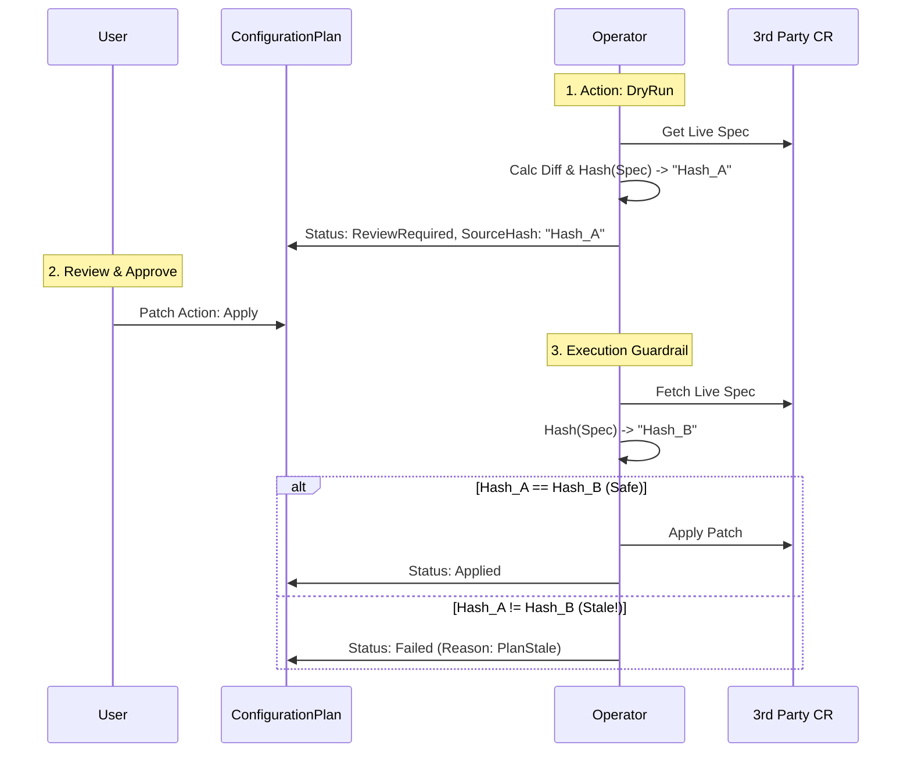
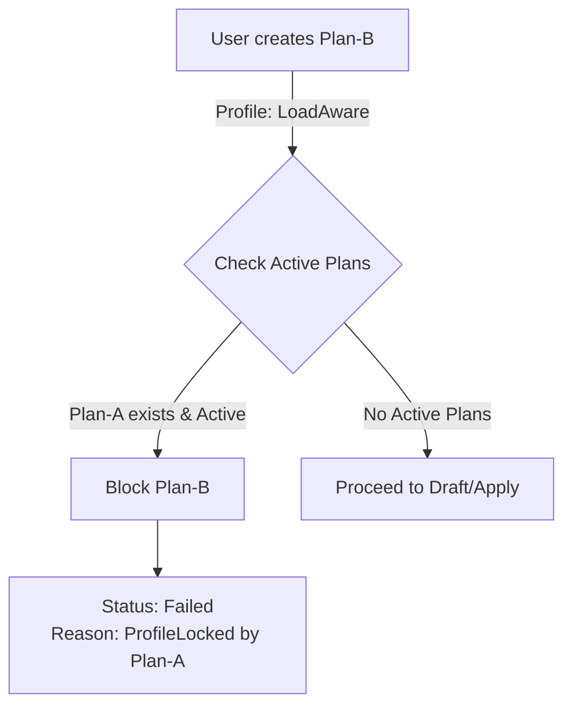
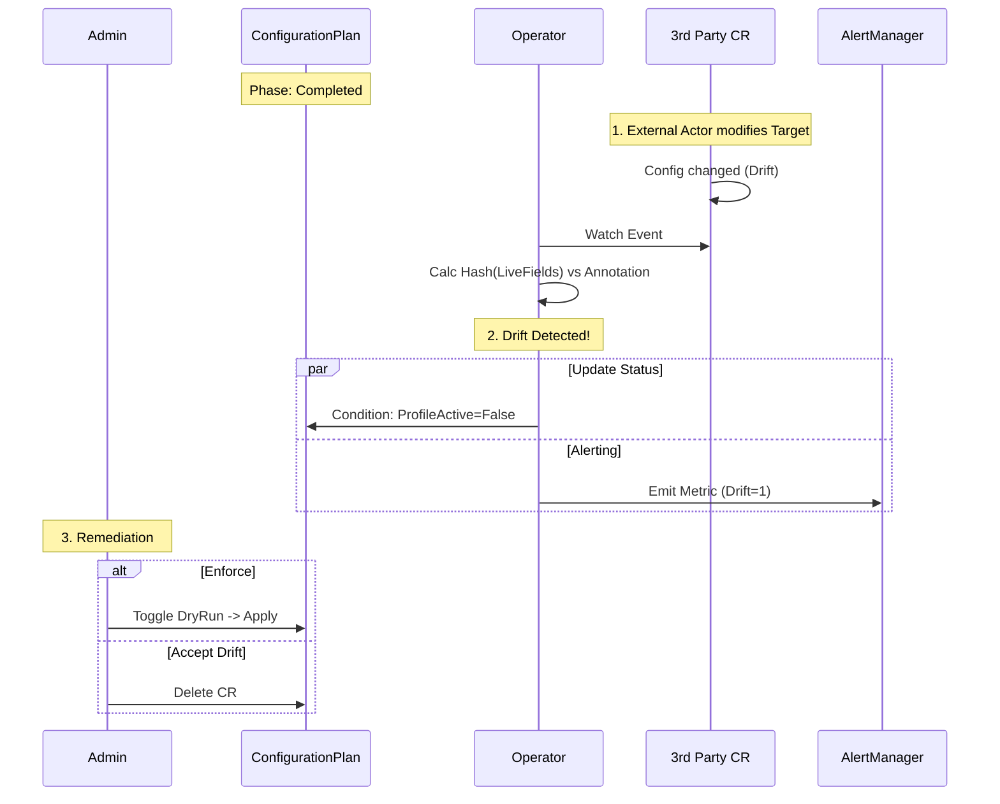
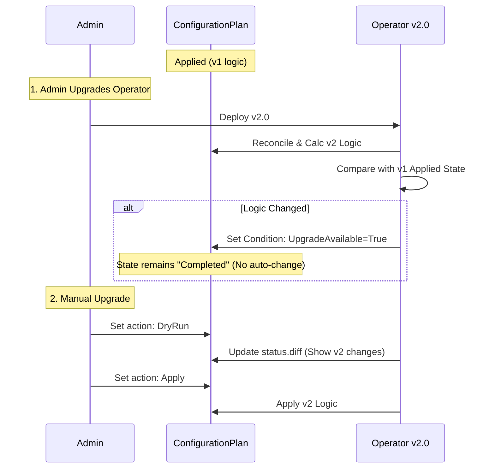

# VEP-NNNN: Operational Governance Layer for 3rd Party Integration

|                      |                                                              |
| :------------------- | :----------------------------------------------------------- |
| **TEP ID** | NNNN                                                         |
| **Status** | Provisional                                                  |
| **Sig** | sig-compute                                                  |
| **Authors** | @tiraboschi                                                  |
| **Created** | 2025-12-10                                                   |
| **Last Updated** | 2025-12-10                                                   |

## Summary

This proposal introduces a new controller and API, `ConfigurationPlan`, designed to act as an **Operational Governance Layer** for OpenShift Virtualization.

Its primary purpose is to configure and tune external, 3rd-party operators (such as the Cluster Descheduler, Node Health Check, or Machine Config Operator) that are not directly owned by the HyperConverged Cluster Operator (HCO). Instead of automatically applying changes, this controller adopts an **"Advisor" pattern**: it detects optimization opportunities based on a selected `profile`, generates a detailed preview (diff) of the proposed changes, and waits for explicit administrative approval before execution.

## Motivation

Configuring a production-grade Virtualization platform often requires tuning components outside the direct scope of the KubeVirt operator. For example:
* Enabling **Load Aware Rebalancing** requires configuring the *Descheduler Operator*.
* Optimizing **Swap** or **NUMA** settings requires creating `MachineConfig` objects via the *Machine Config Operator*.

Currently, cluster admins must manually read documentation, install these external operators, and craft complex configuration patches. This process is error-prone and lacks safety guardrails. If a user blindly applies a `MachineConfig` to enable performance metrics, they might unintentionally trigger a rolling reboot of the entire cluster without warning.

We need a mechanism that bridges the gap between the Virtualization platform's needs and these external tools without taking full ownership of them.

### Goals

* **Soft Dependency Management:** Provide a way to utilize external operators without requiring them as hard dependencies.
* **Preview & Approve Workflow:** Implement a "Plan" pattern where changes are calculated, visualized as a diff, and gated by a specific action (`DryRun` vs `Apply`).
* **Safety by Design:** Prevent conflicts via optimistic locking and singleton profile enforcement.
* **Stable Evolution:** Ensure operator upgrades do not automatically trigger disruptive configuration changes without user review.
* **Drift Management:** Detect and alert if the applied configuration is later modified by external actors.

### Non-Goals

* **Lifecycle Management:** We will not install or upgrade the 3rd party operators. That remains the responsibility of OLM.
* **Continuous Enforcement:** We will not automatically revert external changes. We alert on drift, but leave remediation to the admin.

## Proposal

We propose a new CRD `ConfigurationPlan` in the `hco.kubevirt.io` API group. This resource acts as a state machine for requesting, calculating, and applying complex configuration changes.

### User Workflow & Entry Point

The workflow depends on the admin's desired level of control: **Interactive Review** or **Auto-Approval**.

**1. Discovery:**
The Cluster Admin discovers available profiles via the CRD Schema.
```bash
$ kubectl explain configplan.spec.profile
# Valid values: "LoadAwareRebalancing", "HighDensitySwap"...
```

**2. The "Action" Model:**
The `spec.action` field dictates the controller's behavior:
* **`DryRun` (Default):** The controller calculates the plan, populates the diff in `.status`, and pauses.
* **`Apply`:** The controller calculates the plan and, if prerequisites are met, immediately executes it.

### User Stories

#### Story 1: Interactive Review (Manual Gate)
As a cautious admin, I want to verify changes before they touch production.
1.  I create a manifest with `action: DryRun`.
2.  The Operator sets `status.phase = ReviewRequired` and populates `status.diff`.
3.  I inspect the diff. I decide to proceed: `kubectl patch configplan ... -p '{"spec": {"action": "Apply"}}'`
4.  The Operator advances to execution.

#### Story 2: Auto-Approval (Fire and Forget)
As an admin using GitOps, I want to enable a profile immediately.
1.  I apply a manifest with `action: Apply`.
2.  The Operator immediately checks prerequisites.
3.  Since `action` is `Apply`, it skips the pause and moves directly to `InProgress`.

### API Design

```yaml
apiVersion: hco.kubevirt.io/v1alpha1
kind: ConfigurationPlan
metadata:
  generateName: plan-
spec:
  profile: "LoadAwareRebalancing"
  action: "DryRun"

  # NEW: Control how to handle failures in a multi-step plan.
  # Options: 
  # - "Abort": (Default) Stop executing subsequent items if one fails.
  # - "Continue": Attempt to apply remaining items even if one fails.
  failurePolicy: "Abort"

status:
  phase: InProgress
  sourceSnapshotHash: "sha256:..."

  # NEW: Richer Item Status
  items:
    - name: "enable-psi-metrics"
      # Plan Data (Calculated in DryRun)
      impactSeverity: High
      diff: |
        + apiVersion: machineconfiguration.openshift.io/v1...

      # Execution Data (Updated in Apply)
      # State: Pending | InProgress | Completed | Failed
      state: InProgress
      # Real-time feedback (e.g., "Waiting for MCP update")
      message: "Waiting for MachineConfigPool 'worker' to stabilize (2/10 nodes updated)"
      lastTransitionTime: "2025-10-10T12:00:00Z"
```

### Architecture Details

#### 1. Plan Generation Strategy (The Diff Engine)

To generate accurate, human-readable diffs that respect Kubernetes defaults, webhooks, and co-ownership (e.g., fields managed by ArgoCD), we strictly avoid client-side text comparisons. Instead, we leverage **Server-Side Apply (SSA) in Dry-Run mode**.

**The Generation Algorithm:**
1.  **Construct Intent:** The Operator constructs the desired `ApplyConfiguration` based on the selected `profile`.
2.  **Dry-Run Apply:** It sends a PATCH request with `DryRun: ["All"]` and `FieldManager: "hco-governance"`.
3.  **Sanitize:** It retrieves the Live Object and the Result Object, stripping noise (timestamps, `managedFields`).
4.  **Compute Diff:** It calculates the Unified Diff between `Sanitized(Live)` and `Sanitized(Result)`.

**Handling Defaults & Explicit Intent:**
Profiles must be **Exhaustive**. If a CRD default is `true` but the live object is `false`, the profile logic must explicitly send `true` in the patch. SSA will not re-apply defaults unless the field is present in the configuration.

#### 2. Conflict Handling (Optimistic Locking)
To prevent TOCTOU (Time-of-Check to Time-of-Use) conflict, we use a snapshot hash.
* **Drafting:** We store `status.sourceSnapshotHash = Hash(LiveTarget.Spec)`.
* **Execution:** We check `Hash(LiveTarget.Spec) == status.sourceSnapshotHash`.
* **Reaction:** If they mismatch, the plan fails with a `PlanStale` condition.



#### 3. Handling Concurrent Plans (Singleton Locking)
To prevent conflicting instructions, we enforce a strict **One-Plan-Per-Profile** rule. A `profile` cannot be managed by multiple `ConfigurationPlan` objects simultaneously.

**The Logic:**
If `plan-B` targets profile `LoadAware`, the operator checks if any other active plan exists for `LoadAware`. If yes, `plan-B` is blocked.



#### 4. Handling Configuration Churn (Drift Detection)
Once a plan is `Completed`, the Operator enters a **Governance Watch Mode**. We adopt an **"Inform, Don't Fight"** strategy.

**Drift Strategy:**
1.  **Fingerprinting:** Upon application, we annotate the target resource with `hco.kubevirt.io/applied-profile-hash`.
2.  **Detection:** We watch the target. If `Hash(LiveFields) != AnnotationHash`, drift is detected.
3.  **Reaction:** We set the Plan status to `Drifted` and emit a Prometheus metric. We do **not** auto-revert.



#### 5. Release & Evolution Strategy (Upgrades)
To ensure stability during operator upgrades, we adhere to a **"Sticky Logic"** policy.

**Upgrade Workflow:**
1.  **Detection:** When the Operator upgrades, it recalculates the *ideal state* using new code.
2.  **Comparison:** It compares this new ideal vs. the currently applied items.
3.  **Action:** If logic differs, it sets `UpgradeAvailable=True` but does **not** touch the cluster.
4.  **User Action:** To apply the new logic, the user must re-trigger the Plan (`DryRun` -> `Apply`).



#### 6. Execution Orchestration (The Sequential Engine)
When `action` is set to `Apply`, the controller executes the generated `items` list **sequentially** (0 -> N). This order is critical because profiles often have dependencies (e.g., "Create the MachineConfig first" -> "Wait for Reboot" -> "Then configure the component that relies on it").

**The State Machine per Item:**

1.  **Pending:** The item waits for the previous item to reach `Completed`.
2.  **InProgress:**
    * The patch is applied.
    * **Wait Strategy:** If the item has `impactSeverity: High` (e.g., MachineConfig), the controller enters a polling loop. It checks the health of the related workload (e.g., is `MachineConfigPool` ready? Is the `Deployment` available?).
    * The `status.items[i].message` is updated periodically with progress to provide feedback to the admin.
3.  **Completed:** The resource is applied and verified as healthy. The controller proceeds to `i+1`.
4.  **Failed:** The patch failed API validation or the wait strategy timed out.

**Handling Failures (`failurePolicy`):**

* **If `failurePolicy: Abort` (Default):**
    * The current item is marked `Failed`.
    * All subsequent items remain `Pending`.
    * The global Plan Phase becomes `Failed`.
    * *Reasoning:* Prevents leaving the cluster in an inconsistent, half-configured state if a dependency breaks.
* **If `failurePolicy: Continue`:**
    * The current item is marked `Failed`.
    * The controller logs the error and proceeds to execute item `i+1`.
    * The global Plan Phase becomes `CompletedWithErrors` at the end.

## Examples

To illustrate the controller's behavior, we present a real-world scenario: enabling **"Load Aware Rebalancing & Node PSI Metrics"**. This profile requires two distinct operations:
1.  **Tuning:** Modifying an existing `KubeDescheduler` (Merge operation).
2.  **Infrastructure:** Creating a new `MachineConfig` to enable Pressure Stall Information (PSI) kernel arguments (Create operation).

### 1. The User Intent
The admin creates the following Plan:

```yaml
apiVersion: hco.kubevirt.io/v1alpha1
kind: ConfigurationPlan
metadata:
  generateName: enable-psi-scheduling-
spec:
  profile: "LoadAwareRebalancing"
  action: "DryRun"
  failurePolicy: "Abort" # Stop if the MachineConfig fails
```

### 2. The Generated Status (Dry Run)
The operator reconciles the plan. It populates the diffs and initializes the item states to `Pending`.

```yaml
status:
  phase: ReviewRequired
  sourceSnapshotHash: "sha256:a1b2c3d4..."
  
  conditions:
  - type: UpgradeAvailable
    status: "False"

  items:
  # ITEM 1: The Descheduler
  - name: "configure-descheduler"
    state: Pending
    targetRef:
      kind: KubeDescheduler
      name: cluster
    impactSeverity: None
    diff: |
      apiVersion: operator.openshift.io/v1
      kind: KubeDescheduler
      metadata:
        name: cluster
      spec:
    -   deschedulingIntervalSeconds: 30
    +   deschedulingIntervalSeconds: 60
    +   evictionLimits:
    +     node: 2
    +     total: 5
        profiles:
    -     - LongLifecycle
    +     - KubeVirtRelieveAndMigrate
        profileCustomizations:
    +     devActualUtilizationProfile: PrometheusCPUCombined
    +     devDeviationThresholds: AsymmetricLow
    -     devEnableSoftTainter: false
    +     devEnableSoftTainter: true

  # ITEM 2: The MachineConfig
  - name: "enable-psi-metrics"
    state: Pending
    targetRef:
      kind: MachineConfig
      name: 99-worker-psi-karg
    impactSeverity: High (Reboot Required)
    diff: |
    + apiVersion: machineconfiguration.openshift.io/v1
    + kind: MachineConfig
    + metadata:
    +   labels:
    +     machineconfiguration.openshift.io/role: worker
    +   name: 99-worker-psi-karg
    + spec:
    +   kernelArguments:
    +     - psi=1
```

### 3. Execution (Apply)
When the user switches `action` to `Apply`, the Operator updates the status in real-time as it progresses through the list.

**Snapshot during execution (Item 2 is rolling out):**

```yaml
status:
  phase: InProgress
  items:
  - name: "configure-descheduler"
    state: Completed
    message: "Patch applied successfully"
    lastTransitionTime: "2025-10-10T12:00:00Z"
    
  - name: "enable-psi-metrics"
    state: InProgress
    message: "Waiting for MCP 'worker' to stabilize (Updated: 2/10 nodes, Ready: 2/10 nodes)"
    lastTransitionTime: "2025-10-10T12:05:00Z"
```

**Snapshot after completion:**

```yaml
status:
  phase: Completed
  items:
  - name: "configure-descheduler"
    state: Completed
    
  - name: "enable-psi-metrics"
    state: Completed
    message: "MCP 'worker' is stable and ready"
```

#### Orchestration Flow:
When the user switches `action` to `Apply`, the Operator:
1.  **Verifies Safety Hash:** Checks `sourceSnapshotHash` matches live state.
2.  **Item 1 (Descheduler):** * Applies patch.
    * Status: `state: Completed`, `message: Applied successfully`.
3.  **Item 2 (MachineConfig):**
    * Applies manifest.
    * **Wait Loop:** The operator detects `MachineConfig` type. It checks the `worker` MCP status.
    * Status: `state: InProgress`, `message: Waiting for MCP rollout (Updated: 2/10, Ready: 2/10)`.
    * *(Time passes...)*
    * Status: `state: Completed`, `message: MCP Ready`.
4.  **Completion:** All items are `Completed`. Global Phase becomes `Completed`.

## Implementation Guidelines

To maintain the "Advisor" role without creating hard dependencies (Golang imports) on 3rd-party operators, the controller must be implemented using controller-runtime **Dynamic Client** patterns. This ensures the Governance Operator can be installed on a cluster even if the tools it manages (e.g., Descheduler) are not present.

### 1. Managing Soft Dependencies (Dynamic Interaction)
The controller **must not** import the API packages of the external operators (e.g., `github.com/openshift/descheduler-operator/api`). Doing so creates a rigid dependency chain.

**Strategy: Unstructured Objects**
Instead, we use `unstructured.Unstructured` for all interactions with 3rd-party resources. This allows the controller to manipulate resources based on GVK (GroupVersionKind) without compiling their types into the binary.

```go
// Example: construct the Descheduler object dynamically
u := &unstructured.Unstructured{}
u.SetGroupVersionKind(schema.GroupVersionKind{
    Group:   "operator.openshift.io",
    Version: "v1",
    Kind:    "KubeDescheduler",
})
// Interaction uses generic maps
u.Object["spec"] = map[string]interface{}{
    "mode": "Automatic",
    // ...
}
```

### 2. Dependency Discovery & Validation
Before generating a plan, the controller must verify that the environment supports the requested Profile. This goes beyond simple version checking; it involves **Capability Discovery**.
We don't want to relay on statics semver checks on CSV (that is going to disappear on OLMv1) but to dynamically check the capabilities of the installed operators.

**A. Existence Check (CRD Detection)**
The controller checks if the required CRD is registered in the API Server using the RESTMapper.
```go
func isCRDAvailable(mgr manager.Manager, gvk schema.GroupVersionKind) bool {
    mapper := mgr.GetRESTMapper()
    _, err := mapper.RESTMapping(gvk.GroupKind(), gvk.Version)
    return err == nil
}
```

**B. Capability Check (Schema Introspection)**
To ensure a specific configuration (e.g., a specific Descheduler profile) is valid, we should inspect the **CRD OpenAPI Schema** rather than relying on the Operator version. This allows us to detect valid values (enums) dynamically.

*Example: Checking if `HighNodeUtilization` is a valid profile.*
1.  Fetch the `CustomResourceDefinition` (CRD) for `kubedeschedulers.operator.openshift.io`.
2.  Traverse the JSON Schema: `spec.versions[].schema.openAPIV3Schema.properties.spec.properties.profiles.items.enum`.
3.  Check if `KubeVirtRelieveAndMigrate` or `DevKubeVirtRelieveAndMigrate` are in the allowed list.

### 3. Handling Missing Dependencies in `ConfigurationPlan`
If a soft dependency is missing or incompatible, the `ConfigurationPlan` must gracefully halt to avoid crashing the controller.

**State Transitions:**
1.  **Detection:** Reconciler detects `KubeDescheduler` GVK is missing via RESTMapper.
2.  **Status Update:**
    * **Phase:** `PrerequisiteFailed`
    * **Condition:** `Type=PrerequisitesMet`, `Status=False`, `Reason=MissingDependency`.
    * **Message:** *"The CRD 'KubeDescheduler' is not found. Please install the Descheduler Operator via OLM."*
3.  **Behavior:** The controller **stops processing** (does not attempt to calculate Diff) and re-queues with a slow backoff (e.g., 5 minutes) to check if the user installed it later.

### 4. Controller Setup (Restart on Discovery)
We cannot register a standard `Watch` for a Kind that doesn't exist at startup, as this would cause the controller to crash during setup.
Handling dynamic watchers in `controller-runtime` is complex and prone to race conditions. Instead, we adopt a **"Restart on Discovery"** strategy.

**The Strategy:**
1.  **Initial Setup:** On startup, the controller checks for the existence of optional CRDs (e.g., `KubeDescheduler`). If found, it registers standard watches. If not, it skips them and marks the dependency as "Missing".
2.  **Sentinel Watch:** The operator registers a specific watch on `CustomResourceDefinitions` (CRDs).
3.  **Detection & Restart:**
    * If the Sentinel detects the creation of a CRD that was previously marked "Missing" (e.g., the user just installed the Descheduler Operator), it logs an event and **exits the process** (`os.Exit`).
    * Kubernetes restarts the Pod.
    * On the new boot, the "Initial Setup" finds the CRD and correctly registers the watch.

**Code Example (Sentinel):**
```go
func (r *CRDSentinel) Reconcile(ctx context.Context, req ctrl.Request) (ctrl.Result, error) {
    if isInterestingCRD(req.Name) && wasMissing(req.Name) {
        log.Info("Soft dependency discovered. Restarting to enable watchers.", "crd", req.Name)
        os.Exit(0) // Let Kubelet restart us
    }
    return ctrl.Result{}, nil
}
```
## RBAC & Security Model

Since this operator functions as a high-privilege **Governance Layer** capable of rebooting nodes (`MachineConfig`) and altering global scheduling (`KubeDescheduler`), its RBAC permissions must be broad but strictly justified.

To mitigate the risk of this operator becoming a "privilege escalation backdoor," we rely on the `ConfigurationPlan` CR as the **Audit Log** and **Authorization Gate**. No action is taken without a persisted, approved CR.

### 1. Core Permissions
The operator requires standard access to its own API group to manage the state machine.

```yaml
rules:
  - apiGroups: ["hco.kubevirt.io"]
    resources: ["configurationplans", "configurationplans/status"]
    verbs: ["get", "list", "watch", "update", "patch"]
```

### 2. 3rd Party Target Access (The "Keys to the Kingdom")
The operator needs write access to the specific resources defined in its supported Profiles.
* **Justification:** To apply the calculated Diff.
* **Scope:** We should attempt to limit this to specific resources if possible, but Cluster-scoped operators usually require Cluster-scoped RBAC.

```yaml
rules:
  # Descheduler Tuning
  - apiGroups: ["operator.openshift.io"]
    resources: ["kubedeschedulers"]
    verbs: ["get", "list", "watch", "patch"] # 'patch' is required for SSA

  # Node Tuning & Reboots (High Risk)
  - apiGroups: ["machineconfiguration.openshift.io"]
    resources: ["machineconfigs"]
    verbs: ["get", "list", "watch", "create", "delete", "patch"]
  
  # Monitoring Rollouts
  - apiGroups: ["machineconfiguration.openshift.io"]
    resources: ["machineconfigpools"]
    verbs: ["get", "list", "watch"] # Read-only to track reboot progress
```

### 3. Dynamic Discovery Permissions
To support the "Soft Dependency" model (checking if a CRD exists without crashing), the operator needs to read global discovery information.

```yaml
rules:
  - apiGroups: ["apiextensions.k8s.io"]
    resources: ["customresourcedefinitions"]
    verbs: ["get", "list", "watch"]
```

### 4. Security Mitigations
* **No `update` verb:** We prefer `patch` (Server-Side Apply) over `update` to ensure we do not accidentally overwrite fields owned by other controllers (like GitOps agents).
* **No `secrets` access:** This operator purely tunes configuration and infrastructure; it generally does not need to read Secrets, reducing the blast radius if compromised.
* **Provenance & Traceability:** Since Kubernetes audit logs only show the Operator's ServiceAccount as the actor, we explicitly link resources to their intent. The operator will apply a hco.kubevirt.io/governed-by annotation to every created resource, containing the ConfigurationPlan name. This allows administrators to trace any infrastructure object (like a MachineConfig) back to the specific Governance CR that requested it.

## Testing Strategy

Since this controller relies heavily on **Server-Side Apply (SSA)** for diff generation and **Optimistic Locking** for safety, standard unit tests with the `controller-runtime` fake client are insufficient. The fake client does not fully replicate SSA field management or Dry-Run semantics.

### 1. Integration Testing (`envtest`)
The primary testing vehicle will be **EnvTest**. This spins up a real `etcd` and `kube-apiserver` locally, ensuring that SSA, `managedFields`, and Dry-Run patches behave exactly as they would in production.

**Key Test Scenarios:**
* **Diff Generation:** Create a `ConfigurationPlan` with `action: DryRun`. Verify `status.diff` correctly hides fields owned by other managers (simulating ArgoCD ownership) and shows expected changes.
* **Safety Lock:**
    1.  Generate a Plan (`ReviewRequired`).
    2.  Manually patch the target resource (changing the hash).
    3.  Update Plan to `Apply`.
    4.  **Assert:** Plan fails with `PlanStale` condition.
* **Orchestration:** Verify that items are applied sequentially and that `failurePolicy: Abort` stops execution upon a simulated failure.

### 2. Mocking 3rd Party CRDs
To test soft dependencies without installing the actual operators, we will dynamically register "Stub CRDs" in `envtest` during suite setup.
* **Stubbing:** We register a bare-bones `KubeDescheduler` CRD structure so the API server accepts the resource, allowing us to test our controller's "Missing CRD" detection and SSA logic without the full vendor payload.

### 3. End-to-End (E2E) Tests
Real cluster tests are required for scenarios involving actual infrastructure changes (reboots).
* **MachineConfig Rollout:** Verify that the controller correctly interprets `MachineConfigPool` status (Degraded/Updating/Ready) and reflects this in the item's `message`.
* **Drift Detection:** Apply a plan, then externally modify the resource using `kubectl`. Assert that the controller sets the `Drifted` condition and emits the Prometheus metric.

### Risks and Mitigations

| Risk | Mitigation |
| :--- | :--- |
| **Conflict with GitOps** | The "Inform, Don't Fight" strategy ensures we never enter a reconciliation loop with ArgoCD. |
| **Duplicate Plans** | The Singleton Locking mechanism prevents multiple plans from managing the same profile. |
| **Unexpected Changes on Upgrade** | The "Sticky Logic" policy prevents new operator versions from automatically modifying cluster state. |
| **Stale Plans** | The Optimistic Locking (Hash check) prevents applying old plans to changed clusters. |

## Future Work

### OpenShift Console Integration
This API has been explicitly designed to support a rich, wizard-driven experience in the OpenShift Console. By decoupling the calculation (`DryRun`) from the execution (`Apply`) and exposing a readable `diff` in the status, the Console can implement:
1.  **Review Modals:** Visual diffs before approval.
2.  **Progress Tracking:** Step-by-step checklists for long-running items.
3.  **Upgrade Alerts:** Badges for `UpgradeAvailable`.

## Alternatives

### 1. Documentation only (today)
High user friction, error-prone.

### 2. Pure GitOps (Manual Configuration)
The primary alternative is to rely on standard GitOps workflows (ArgoCD/Tekton) where the administrator manually defines the full `KubeDescheduler`, `MachineConfig`, and `KubeletConfig` resources and commits them to a repository.

**Why this was rejected:**
While GitOps handles the *delivery* of configuration, it fails to solve the **Authoring** and **Safety** problems:
* **Cognitive Load:** The admin must possess deep, expert-level knowledge of KubeVirt internals (e.g., knowing the exact Kernel arguments for PSI or the specific eviction thresholds for descheduling).
* **Lack of Guardrails:** A typo in a manually crafted `MachineConfig` can trigger an immediate, unintended rolling reboot of the entire cluster. GitOps tools apply changes blindly; they do not semantically analyze the *impact* (e.g., "This change requires a reboot").
* **Static vs. Dynamic:** A static GitOps manifest cannot easily adapt to the environment (e.g., "Only enable profile X if the Descheduler Operator is actually installed").

The `ConfigurationPlan` acts as an **intelligence layer** that generates the correct, safe configuration for the user, which they can *then* manage via GitOps if they choose.

### 3. OLM InstallPlans
We considered using the Operator Lifecycle Manager (OLM) to bundle these configurations.

**Why this was rejected:**
* **Scope Mismatch:** OLM is designed for *software lifecycle* (install/upgrade), not for *operational tuning* (configuring the software).
* **Granularity:** OLM upgrades are "all or nothing." You cannot easily toggle a specific performance tuning profile on or off using OLM primitives.

### 4. Direct "Autopilot" from HCO
Too dangerous for `MachineConfig` (reboot) changes.
Risk of infinite reconciliation loops with other tools like ArgoCD.

## Open questions
1. Should we implement this as an additional controller in the HCO pod? a completely independent pod executed with a different service account with fine grained RBAC?
2. Should we use a CEL expression to bind the name of the object to the profile it intends to manage?
